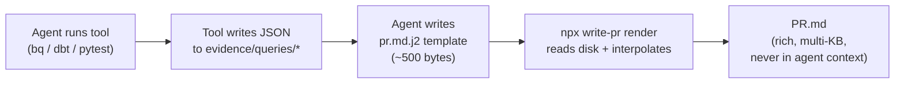

# write-pr

**Evidence-driven Pull Request templating that keeps your agent context clean.**

> The value isn't the template — it's that the template `npx`-compiles from disk, so agent context never holds the 15 KB of query results / CI logs / benchmark dumps the reviewer actually wants to see.

[](https://www.npmjs.com/package/@luutuankiet/write-pr)
[](https://github.com/luutuankiet/write-pr/actions/workflows/publish.yml)
[](https://www.npmjs.com/package/@luutuankiet/write-pr)

## The problem this solves

Writing a good PR description usually means pasting evidence — a 200-row BQ result, a stack trace, a before/after benchmark, a schema diff — into the body. For an agent author that means **every byte ends up in the agent's context window** on the way to the PR body. A rich PR easily burns 15–50 KB of context that the agent reads, transforms slightly, and emits unchanged.

write-pr inverts this. The agent's data-gathering tools (code execution, `bq`, `dbt`, `curl`, `cat`) write to disk. The agent writes only a small template (`pr.md.j2`) that references the disk paths. Then `npx @luutuankiet/write-pr render` reads disk + interpolates + writes the final markdown. **The agent never re-reads the raw evidence.**

## Context cost — back of the envelope

| Pattern | Agent context spent |
|---|---|
| Paste 200-row result table inline as markdown | ~6 KB |
| Paste 30-line stack trace + 50-row benchmark + 4 KB SQL appendix | ~12 KB |
| Same content via write-pr (`load_json('q.json') \| md_table`) | **~80 bytes per fence** |

Multiply by 5–10 evidence blocks in a real refactor PR and the math is brutal. write-pr is the same idea as code execution: keep heavy intermediates out of context, push them through a script that runs once.

## How it works



Step 1's output and step 5's output never co-exist in the agent's context. Only the template (step 3) does.

## Use cases

### 1. Performance regression PR (fully worked)

Agent benchmarks before + after, the benchmark tool writes results to disk, agent writes a 6-line template:

**`evidence/perf.json`** (written by the benchmark tool; agent never reads):

```json
{
  "before": [{"metric": "p95_ms", "value": 1450}, {"metric": "errors/min", "value": 12}],
  "after":  [{"metric": "p95_ms", "value":   55}, {"metric": "errors/min", "value":  0}]
}
```

**`pr.md.j2`** (agent writes — ~150 bytes in context):

```jinja
## Before / After

[% set perf = load_json('perf.json') %]
[[ perf.before | delta_table(perf.after) ]]
```

**Rendered output** (lives only on disk + GitHub, never in agent context):

```markdown
## Before / After

| metric     | before | after | Δ            |
| :---       | :---   | :---  | :---         |
| p95_ms     | 1450   | 55    | -1395 (-96%) |
| errors/min | 12     | 0     | -12 (-100%)  |
```

### 2. Schema migration PR

Agent runs `DESCRIBE` before + after the migration, dumps both to disk as `[{column, type}, ...]` arrays. Template:

```jinja
[[ load_json('schema_before.json') | delta_table(load_json('schema_after.json'), {key: 'column', value: 'type'}) ]]
```

Output: a clean diff showing added / removed columns and type changes. Agent context spent: one line.

### 3. CI failure attribution

Test runner dumps `pytest --json-report` / `jest --json` / `dbt run_results.json` to disk. Agent does a one-pass reshape on disk (jq, code execution), then:

```jinja
[[ load_json('failures.json') | md_table | fold('Failures (12)') ]]
```

Reviewer sees a click-to-expand table. Agent context spent: ~200 bytes total. No raw test output passes through.

### 4. Heavy appendix without polluting the PR body

Any long artifact (full compiled SQL, raw API response, 500-line log) goes through the `fold` filter:

```jinja
[[ load_text('appendix.sql') | fold('Compiled SQL (470 lines)') ]]
[[ load_json('api_dump.json') | json_pretty | fold('Raw API response') ]]
```

GitHub renders these as native `<details>` collapsibles. Agent writes 2 lines; reviewer gets click-to-expand evidence. The 470-line SQL never enters agent context.

## Quick start

```bash
# Install the bundled skill into the current project (.claude/skills/write-pr/)
npx -y @luutuankiet/write-pr install-skill

# Or globally (~/.claude/skills/write-pr/)
npx -y @luutuankiet/write-pr install-skill --global

# Render a PR template (after the agent has written pr.md.j2 + dumped evidence)
npx -y @luutuankiet/write-pr render \
  --template pr.md.j2 \
  --evidence ./evidence \
  --out PR.md
```

## The 6 filters

| Filter | Use |
|---|---|
| `md_table` | JSON array → markdown table |
| `json_pretty` | Value → fenced \`\`\`json block |
| `gh_callout` | GitHub TIP / NOTE / IMPORTANT / WARNING / CAUTION |
| `code_expand` | Read source file → fenced code with `file:line` header |
| `delta_table` | Two arrays → before/after table with computed Δ |
| `fold` | Wrap any content in `<details>` collapsible |

Full signatures + 7 rules of thumb + 10 snippet patterns ship inside the skill bundle. See [`skills/write-pr/SKILL.md`](skills/write-pr/SKILL.md) for the agent-facing entry point.

## Custom Jinja delimiters (important)

Templates use `[[ ]]` for variables and `[% %]` for blocks. Default `{{ }}` collides with dbt-Jinja and other tools that emit double-brace syntax inside code-fence evidence (silently renders to empty string). The custom delimiters dodge that without losing any Nunjucks power.

```jinja
[[ load_json('q.json') | md_table ]]

[% if meta.has_breaking_change %]
[[ 'WARNING' | gh_callout(meta.breaking_change_note) ]]
[% endif %]

[# this is a comment, agents-only #]
```

Two template-delimiter edge cases (`[[[ ]]]` trap, literal-filter-in-prose) are documented in `skills/write-pr/rules/template-gotchas.md` with verified workarounds.

## License

MIT — see [`LICENSE`](LICENSE).
