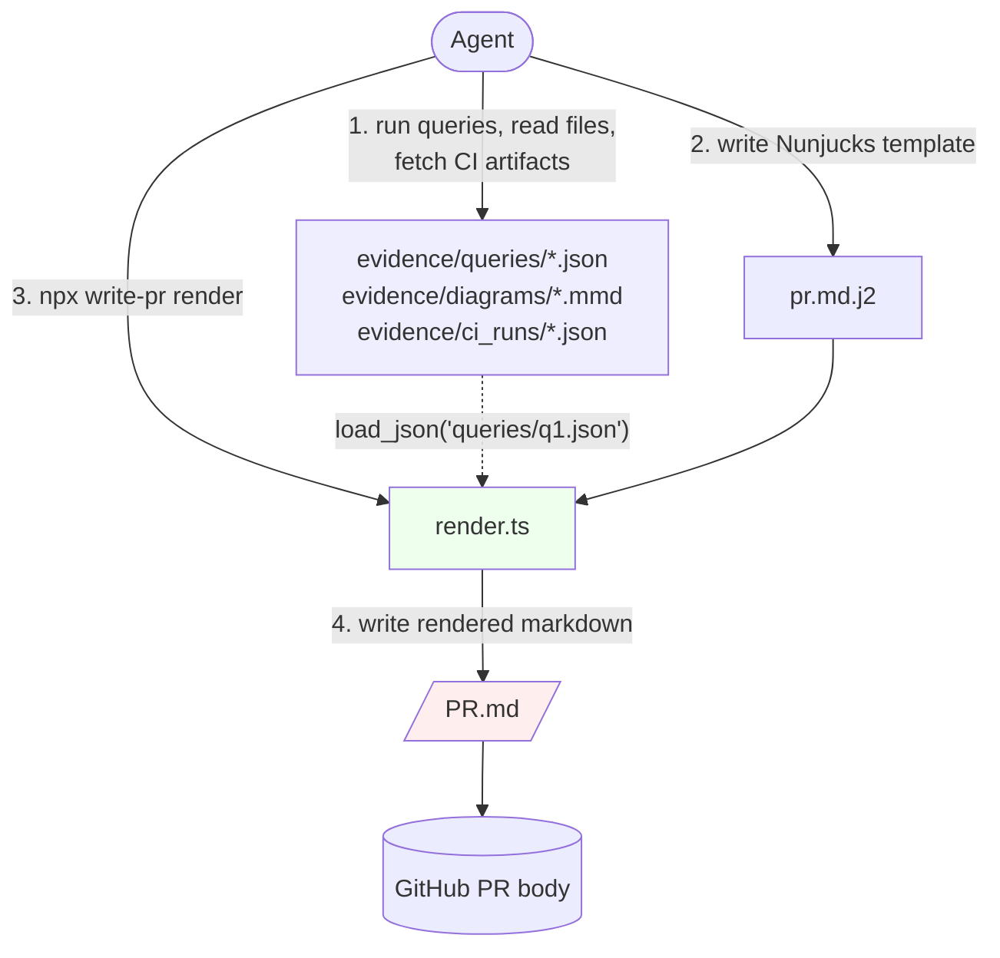

# v0.1.0-alpha.0 — First alpha

## TL;DR

`@luutuankiet/write-pr` — an npm package for **evidence-driven Pull Requests** authored by Claude Code agents. Two-step compile pattern: the agent dumps query results, file reads, and CI artifacts to disk as JSON, writes a Nunjucks template referencing those paths, then `npx ... render` inlines them into the final markdown. **The agent's context never holds raw tool I/O.**

This release establishes the package scaffold + the rendering pipeline + the first filter. The library is intentionally minimal — ship the contract, expand the toolbox in 0.2.x.

## Why this release exists

Writing Pull Requests at the density of a real refactor (3-tier evidence stack: per-product cost SUM → exhaustive 50+ field schema audit → canonical multiset array decomposition → CI failure attribution — plus inline `file:line` code citations + collapsible `<details>` sections) currently requires several rounds of prompting an agent to fill the gaps. Each round burns tokens because the agent has to hold raw BigQuery results, dbt's 5.9 MB `manifest.json`, and dozens of code snippets in context just to reference them in prose.

`write-pr` externalizes that evidence to disk and lets a thin render pass inline it via Nunjucks filters. The agent's context stays small. The PR output stays dense.

## Highlights

| Capability | What it does | Why it matters |
|---|---|---|
| `npx write-pr render` | Nunjucks template + disk evidence → markdown PR | Agent context isn't paying for tool I/O |
| `npx write-pr install-skill [--global\|--path DIR]` | Copies bundled skill into `.claude/skills/write-pr/` | Companion skill is one command away |
| Custom Jinja delimiters `[[ ]]` / `[% %]` | Dodges dbt-Jinja `{{ }}` collision | dbt code blocks inside PR evidence render correctly, not as empty strings |
| `md_table` filter | JSON array → markdown table with auto-aligned numeric cols | First filter; most common evidence shape |
| Bundled minimal example | Synthetic worked example at `skills/write-pr/examples/minimal/` | Agents and humans both onboard from working code, not docs |
| 18 vitest cases | Byte-for-byte round-trip of the minimal example + dbt-Jinja literal preservation + install round-trip | Refactors won't silently break the render contract |

## How it works



The agent never holds BigQuery rows, dbt's 5.9 MB `manifest.json`, or full file contents in its context. The CLI does. The template references them by relative path.

## Before / After

**Before** (agent writes PR from scratch in chat):
```
User: Now add the validation section with the per-product cost SUM
Agent: [runs BQ query, holds 16-row × 4-column result in context,
        formats as markdown table, pastes into chat, copies chat into PR body]
       [3 rounds later: "I notice the per-product table is missing alignment;
        let me fix..."]
```

**After** (with write-pr):
```
User: Add validation section with per-product cost SUM
Agent: bq query --format=prettyjson "..." > evidence/queries/q_per_product.json
       # Edit pr.md.j2 to add: [[ load_json('queries/q_per_product.json') | md_table ]]
       npx -y @luutuankiet/write-pr render \
         --template pr.md.j2 --evidence ./evidence --out PR.md
       # Table renders with numeric columns right-aligned automatically.
       # BQ result lives in evidence/queries/, not in the chat scrollback.
```

## Configuration

```bash
# Install the bundled skill (per-project)
npx -y @luutuankiet/write-pr install-skill

# Or globally
npx -y @luutuankiet/write-pr install-skill --global

# Render a PR (after writing pr.md.j2 + collecting evidence)
npx -y @luutuankiet/write-pr render \
  --template pr.md.j2 \
  --evidence ./evidence \
  --out PR.md
```

Template frontmatter (optional):
```yaml
---
title: "Refactor widget_orders: 96% wall reduction"
root_path: "/repo/root"  # for the upcoming code_expand filter (v0.2.x)
---
```

## Upgrade notes

**Alpha — API may change.** Specifically:

- The `md_table` filter signature is stable, but the upcoming filters (`code_expand`, `ci_summary`, `gh_callout`, `json_pretty`, `mermaid`) are still being designed.
- The bundled skill's `rules/` directory is empty in this alpha. Phase 2 will fill it with `workflow.md`, `disk-convention.md`, `placeholder-vocab.md`, `private-notation.md`, `callout-gotcha.md`, `root-path.md`, and `template-gotchas.md`.
- The `examples/intr_orders_full/` slot (a fully-synthetic equivalent of the reference quality PR) is not bundled in this alpha — drafted, leak-verified, pending final review.

If you're trying this out: pin to `0.1.0-alpha.0` explicitly. `latest` will route to a stable release once 0.1.0 ships.

## Files included

| Path | Purpose |
|---|---|
| `src/cli.ts` | Commander dispatch (`render` + `install-skill` subcommands) |
| `src/render.ts` | Nunjucks env with custom `[[ ]]` / `[% %]` delimiters; loads template + frontmatter + invokes filters |
| `src/install-skill.ts` | Copies bundled skill into target `.claude/skills/write-pr/` (--global, --path, or cwd-relative) |
| `src/filters/md-table.ts` | First filter — JSON array → markdown table |
| `skills/write-pr/SKILL.md` | Agent-facing skill entry point |
| `skills/write-pr/examples/minimal/` | Worked example (template + evidence + expected rendered output) |
| `tests/{md-table,render,install-skill}.test.ts` | 18 vitest cases incl. byte-for-byte round-trip of minimal example |
| `.github/workflows/publish.yml` | Tag-triggered publish via OIDC Trusted Publisher with provenance |
| `tsconfig.json`, `package.json` | TypeScript ESM + `bin` entry |

## Hard truth — known gotchas not yet protected by tests

Two template-engine edge cases were discovered during the synthetic-PR drafting that produced this release:

1. **Markdown-link bracket collision:** `[[[ var ]]]([[ var ]])` — the lexer reads `[[[` as `variableStart` + literal `[`. **Workaround:** insert a character to break the triple-bracket, e.g. `[Job [[ var ]]]([[ var ]])`.
2. **Literal `[[ ... | filter ]]` in prose body:** the engine parses any `[[ ... ]]` pair it sees as a real expression. Using `...` as a placeholder in documentation text causes a render error. **Workaround:** rephrase to avoid literal delim pairs.

Both ship as `rules/template-gotchas.md` + regression tests in v0.2.x. If you hit a render error referencing a `[[`-shaped string in your prose, that's one of these two.

---

**First publish:** `npx -y @luutuankiet/write-pr@0.1.0-alpha.0 install-skill --global`
