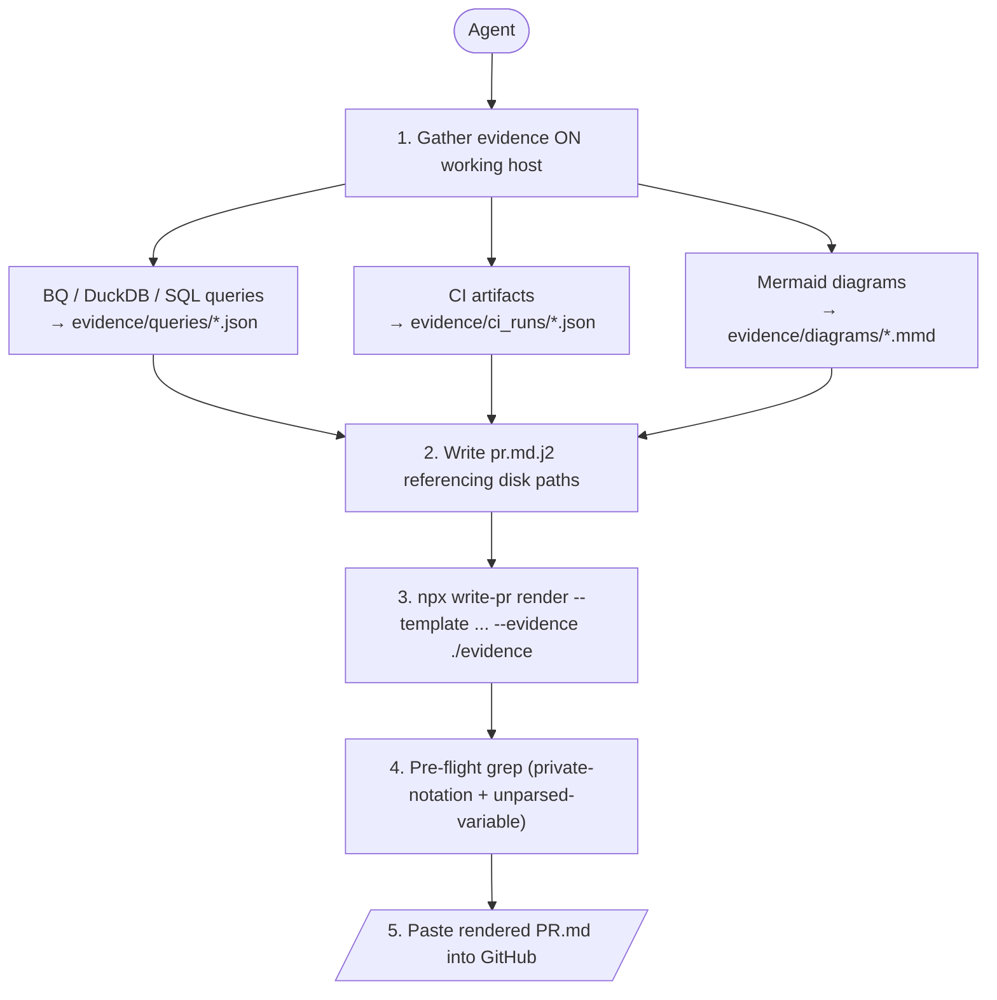

# v0.1.0 — Full filter library, snippet patterns, rules of thumb

## TL;DR

First stable channel release — goes to npm `latest` dist-tag (alpha
channels stay on `next`). Six filters (was 1), ten snippet patterns
(was 0), seven rules-of-thumb docs (was stubs), one expanded round-trip
example that exercises every filter plus snippet include mode. The
public package is now production-shape; the internal distribution
pipeline (CI + SLSA provenance) was verified across two pre-release
iterations and stays unchanged.

## Why this release exists

`v0.1.0-alpha.0` shipped the renderer skeleton and one filter
(`md_table`) to validate the round-trip mechanic plus the npm
distribution boilerplate. `v0.1.0-alpha.1` verified the CI publish
pipeline end-to-end (OIDC + SLSA provenance attestation). This release
fills out the actual write-pr surface area so agents can use it as a
PR-quality framework, not a placeholder.

The trigger was a real-world survey of 7 PRs across 2 client projects:
5/7 led with a TL;DR key/value table, 4/7 used before/after code
sections, 3/7 had Mermaid flowcharts, 2/7 attached dbt CI failure
attribution. Each pattern is now either a filter (data-driven
output) or a snippet (composable section fragment).

## Highlights

| Change | What it does | Why it matters |
|---|---|---|
| 5 new filters | `json_pretty` / `gh_callout` / `mermaid` / `code_expand` / `ci_summary` | Covers every section type from the 7-PR survey |
| 10 snippet patterns | `tldr_kv_table` / `manifest_tip_header` / `before_after_img_table` / `before_after_code` / `design_decision` / `numbered_validation` / `mermaid_flowchart` / `sql_appendix` / `ci_failure_section` / `checklist` | Composable section fragments; copy-paste or `[% include %]` modes both supported |
| Snippet include auto-discovery | renderer walks up from cwd / template dir looking for `.claude/skills/write-pr/` or `skills/write-pr/` | Makes `[% include 'snippets/X.j2' %]` work without a flag |
| 7 rules docs | `workflow` / `disk-convention` / `placeholder-vocab` / `private-notation` / `callout-gotcha` / `root-path` / `template-gotchas` | The "what does the agent need to know about edge cases" surface |
| Expanded minimal example | Exercises all 6 filters + 1 snippet include + nested `<details>` JSON fold | Byte-for-byte round-trip test now covers the full feature set |
| `--global` / `--path` mutex | `install-skill` rejects ambiguous combo with exit 2 | Bug surfaced by the alpha.0 intern subagent test |
| Dynamic CLI version | reads from `package.json` at runtime | No more drift between hardcoded literal and shipped version |

## The two-step compile pattern (unchanged, restated)



The render step reads evidence from disk and applies filters; raw
tool I/O never enters the agent's context. The value is freeing agent
context from raw tool I/O — not the templating itself.

## Filter reference

| Filter | Use |
|---|---|
| `md_table` | JSON array → markdown table (auto-detect cols, numeric-R align) |
| `json_pretty` | Value → fenced ` ```json ` block; `fold=true` wraps in `<details>` |
| `gh_callout` | GitHub callout (`> [!TIP]` etc.); 5 canonical types, case-insensitive |
| `mermaid` | Read `.mmd` file relative to `--evidence` → fenced ` ```mermaid ` block |
| `code_expand` | Read source file relative to `frontmatter.root_path` → fenced block with `# <path>:<lines>` header; supports `annotate` map |
| `ci_summary` | dbt `run_results.json` → status counts + errors + (optional) our-models breakdown |

Full signatures in `skills/write-pr/rules/placeholder-vocab.md`.

## Snippet reference

Ten `.j2` fragments at `skills/write-pr/snippets/`. Each ships with a
documented variable contract in a `[# ... #]` header comment plus a
body that uses those variables. See `snippets/README.md` for the
copy-paste vs `[% include %]` modes.

## Test coverage

59 vitest cases across 8 files (was 18 across 4):

| Test file | Cases | Covers |
|---|---|---|
| `tests/md-table.test.ts` | 10 | filter behavior, edge cases |
| `tests/json-pretty.test.ts` | 5 | indent / fold / custom summary |
| `tests/gh-callout.test.ts` | 9 | 5 types, case-insensitive, multi-line, invalid-type throw |
| `tests/mermaid.test.ts` | 4 | relative + absolute paths, trailing-newline strip |
| `tests/code-expand.test.ts` | 10 | whole file, line range (string + array), lang detect/override, annotate, block-comment langs |
| `tests/ci-summary.test.ts` | 10 | empty results, status counts, errors, our-models (positional + opts), substring match, elapsed time |
| `tests/install-skill.test.ts` | 3 | install path, overwrite, mutex sanity |
| `tests/render.test.ts` | 7 | round-trip byte-for-byte, custom delim, frontmatter title, 2 gotcha regressions |

## Upgrade notes (from alpha.X)

- **`--path` and `--global` are now mutually exclusive** (was: `--path` silently won). One-flag usage is unaffected.
- **Snippet include mode added** — `[% include 'snippets/X.j2' %]` now resolves if the renderer can find `.claude/skills/write-pr/` or `skills/write-pr/` walking up from cwd or template dir.
- **CLI version** now reads from `package.json` at runtime (was hardcoded `0.1.0-alpha.0` literal). No user-facing change beyond `write-pr --version` reporting the actual installed version.
- **`evidence_dir` global** added to template scope — lets templates pass `root_path=evidence_dir` into `code_expand` for self-contained examples where source code lives next to evidence.

## Verification

- 59/59 vitest cases pass
- `npm pack --dry-run`: 36 files, 21.2 kB tarball, 56.4 kB unpacked
- Pre-release leak audit: 0 hits for `LOG-` / `TASK-` / `WORK.md` / `gsd-lite/` / client identifiers in shipped content (skills/, dist/, README.md)
- Byte-for-byte round-trip: bundled minimal example renders to 1469 bytes matching `pr.rendered.md` exactly

## Hard truth

The `[% raw %]` workaround originally documented in `rules/template-gotchas.md` got debunked during this release's regression-test phase — nunjucks' raw-mode lexer hard-codes default `` delimiters, so `[% raw %]` parses as a regular block tag and `[% endraw %]` fails with `unknown block tag: endraw`. The doc now ships the working pattern (string-literal interpolation: `` `[[ "[[ rows | md_table ]]" ]]` ``).

This is a real limitation in nunjucks 3.x. If write-pr ever upstreams a custom-delim-aware raw-mode patch (or migrates off nunjucks), the docs can be revisited.

## Files changed

NEW source files: `src/filters/{json-pretty,gh-callout,mermaid,code-expand,ci-summary}.ts`

MODIFIED source files:
- `src/render.ts` — 5-filter registry + snippet-discovery walker + `evidence_dir` global
- `src/cli.ts` — `--global`/`--path` mutex guard + version-from-package.json

NEW skill bundle files:
- `skills/write-pr/snippets/*.j2` (10) + `snippets/README.md`
- `skills/write-pr/rules/*.md` (7)
- `skills/write-pr/examples/minimal/evidence/code/widget_cache.py`
- `skills/write-pr/examples/minimal/evidence/diagrams/widget_flow.mmd`

MODIFIED skill bundle files:
- `skills/write-pr/SKILL.md` — reflect 6 filters + 10 snippets + 7 rules
- `skills/write-pr/examples/minimal/pr.md.j2` — exercises all filters + snippet include
- `skills/write-pr/examples/minimal/pr.rendered.md` — new byte-for-byte fixture

NEW tests: `tests/{json-pretty,gh-callout,mermaid,code-expand,ci-summary}.test.ts` (38 cases)

MODIFIED tests:
- `tests/render.test.ts` — +2 template-gotcha regressions
- `tests/install-skill.test.ts` — +1 mutex sanity

**Full Changelog**: https://github.com/luutuankiet/write-pr/compare/v0.1.0-alpha.1...v0.1.0
