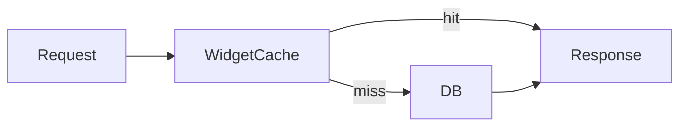

# Demo PR: add widget cache

> [!TIP]
> Synthetic demo PR — exercises every write-pr filter and one snippet include. Real refactor PRs follow the same skeleton.


## TL;DR

| metric | value |
| :--- | :--- |
| Wall time before | 1450ms |
| Wall time after | 55ms |
| Reduction | 96% |


## Changes

```py
# code/widget_cache.py:1-6
class WidgetCache:
    def __init__(self):
        self._cache = {}

    def get(self, widget_id):
        return self._cache.get(widget_id)
```

## Validation

| test_name | status | duration_ms |
| :--- | :--- | ---: |
| test_widget_cache_hit | pass | 12 |
| test_widget_cache_miss | pass | 18 |
| test_widget_eviction | pass | 9 |

## Data Flow



## Appendix

<details><summary>Raw query result (JSON)</summary>

```json
{
  "summary": [
    {
      "metric": "Wall time before",
      "value": "1450ms"
    },
    {
      "metric": "Wall time after",
      "value": "55ms"
    },
    {
      "metric": "Reduction",
      "value": "96%"
    }
  ],
  "validation": [
    {
      "test_name": "test_widget_cache_hit",
      "status": "pass",
      "duration_ms": 12
    },
    {
      "test_name": "test_widget_cache_miss",
      "status": "pass",
      "duration_ms": 18
    },
    {
      "test_name": "test_widget_eviction",
      "status": "pass",
      "duration_ms": 9
    }
  ]
}
```

</details>
